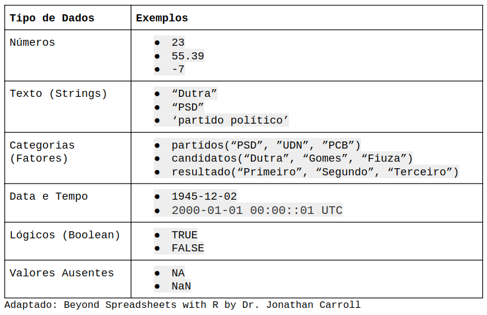

# Introdução ao R e ao RStudio

```{r global_options, include=FALSE}
knitr::opts_chunk$set(fig.width=12,
                      fig.height=8,
                      warning=FALSE,
                      message=FALSE,
                      eval=FALSE)
```

## Parte 1 - Overview

## O que é o R e o RStudio?

### Linguagem de programação R

O __R__ é uma linguagem de programação que vem crescendo bastante nos últimos anos. Apesar de inicialmente ter como público estatísticos, a linguagem é uma das mais utilizadas para análise de dados nas mais diferentes frentes. A flexibilidade trazido por uma ínumera quantidade de pacotes permite lidar não só com tabelas estilo Excel, mas também com texto, imagens, etc.

Quando baixamos o __R__ pela primera vez nos assustamos com a sua interface, pois ela não é das mais agradáveis.

```{r fig.align='center', eval=TRUE}
knitr::include_graphics("imgs/r_console.png")
```

Para solucionar isto e adicionar outras funcionalidades que melhoram a experiência de quem utiliza a linguagem, foi desenvolvido uma IDE (Ambiente de desenvolvimento integrado) chamada _RStudio_.

### RStudio

O _RStudio_ nada mais é que um software, que integrado com o R, permite uma interação melhor com os objetos e rotinas criados com o R. O programa tem quatro painéis/seções:

```{r fig.align='center', eval=TRUE}
knitr::include_graphics("imgs/rstudio_print.png")
```

    A - Console: Local na qual temos o R prompt e que podemos executar linha por linha (chamados de inputs). Além disso, é o local no qual os resultados (chamados de outputs) irão aparecer.
    
    B - File/Plots/Help: Nesta seção podemos ter acesso às pastas que estamos utilizando durante as nossas rotinas no software, além de visualizar os gráficos gerados a partir das análises e verificar a documentação de funções e pacotes, que explicaremos em breve.
    
    C - Workspace: Os valores gerados no R, como por exemplo, variáveis e tabelas que você definiu irão aparecer aqui, sobretudo, na aba Environment. E o histórico de códigos rodados na aba History. Veremos nas próximas aulas que a aba Connections é útil caso estejamos conectados com alguma base de dados externa, como por exemplo, Access ou PostgreSQL.
    
    D - Editor: Aqui é onde os scripts são escritos. Scripts nada mais são do que uma série de comandos salvos em um arquivo. Eles são úteis para mantermos a reprodutividade do código, portanto, sempre que formos utilziar o RStudio é recomendado escrever um script.
    
Podemos então começar a escrever nossas primeiras linhas de código!

## Abrindo um script

1- Podemos começar um novo script do zero

2 - Ou podemos abrir um script que já foi trabalhado

File →  Open file  → Aula1.R       

Atenção à extensão .R

Num script tem linhas de comando e também linhas de comentários.
Para marcarmos comentários basta colocarmos # 
Dessa forma, o R não executará o que está escrito depois das aspas

## Algumas regras de boa conduta

1. Não escreva diretamente no console. Salve o seu código __sempre__ em um script. Assim conseguimos salvor todas as decisões tomadas durante uma análise e pertmir com que uma outra pessoa também chegue nos resultados que obtivermos.

2. __Nunca__ sobreponha o banco de dados. Uma vez que você tem um _script_, não é preciso salvar as alterações já que você será capaz de reproduzir os resultados no futuro.

3. Comente o seu código. Lembre-se que outras pessoas irão ler o seu código e que elas não fazem ideia do que passava na sua cabeça quando você tomou algumas decisões. Além disso, o seu eu do futuro irá agredecer um código bem documentado caso seja necessário revisitá-lo.

## Nossas primeiras linhas de código

Uma das funcionalidades mais básicas do __R__ é realização de operações matemáticas. Se estamos digitando os comandos em um _script_, basta colocarmos o cursor do mouse na linha do código e apertar `Ctrl + Enter` e o resultado sairá no Console, assim como já havíamos mencionado.

```{r}
3 + 1 # Soma

3 - 2 # Subtração

4 * 2 # Multiplicação

5 / 2 # Divisão
```

## Objetos e atribuições I

“To understand computations in R, two slogans are helpful:
• Everything that exists is an object.
• Everything that happens is a function call."
— John Chambers

Dados são guardados dentro de objetos.

- Objetos possuem diferentes formas de estruturas os dados:

  + Vetores

  + Listas 

  + DataFrames

- Objetos podem conter diferentes tipos de dados:

  + Números

  + Strings

  + Fatores

### Atribuindo valores à variáveis (`<-`)

Quando fizemos as operações matemáticas, não salvamos os nossos resultados. Logo, caso quiséssemos acessar novamente, por exemplo, o resultado de `3 + 1`, seria necessário digitar novamente `3 + 1` e efetuar a operação. Contudo, é possível salvar os resultados em variáveis e, ao fazer referência a essas variáveis, obter outro resultado.

```{r}

3 + 1

a <- 3 + 1

a * 2

b <- (“Hello, world”)

b

dado <- c(1,2,3,4,5,6)

dado
```

### Tipos de dados

```{r fig.align='center', eval=TRUE}

```

#### Lidando com números

De certa maneira, estamos muito acostumados com esse tipo de dados. Você consegue pensar em algum exemplo? Os minutos passados entre o momento que você saiu de casa e chegou nesta sala de aula é exemplo. Além desse, podemso pensar na renda mensal da sua família, na quantidade de livros que você possui e assim por diante.

Tipos numéricos podem ser divididos em __inteiros__ (_integers_) e __reais__ (_float_). Diferentemente de outras linguagens de programação, você dificilmente terá que se preocupar com isso no R. 


```{r}
3 # numero inteiro

55.4 # numero real

```

### Lidando com texto

Outro tipo de variável muito conhecida é o texto ou _string_. Para declaramos um texto no R podemos utilizar aspas simples (`''`) ou aspas duplas (`""`), mas lembre-se não podemos intercalar as aspas, como por exemplo, `'olá mundo"`.

```{r}
"Vargas"
```

```{r}
'Janio Quadros'
```

```{r}
"1945"
```

Perceba que devido ao fato de 1945 estar entre aspas, ele não é mais um dado do tipo número, mas sim texto.

### Lidando com fatores

Vamos supor que estamos trabalhando com dados de survey e em uma das questões temos a escala likert, em que as respostas vão do "Discordo totalmente" até o "Concordo totalmente" contabilizando um total de 6 categorias de resposta. Ocorre que para que o __R__ entenda este tipo de dado como algo categórico, precisamos transformá-los em fatores (factors).

Para fazer essa transformação, utilizaremos uma função chamada `factor()` que recebe como parâmetro um vetor com o que queremos transformar em categorias.

```{r}
factor(c("Discordo totalmente", "Discordo parcialmente", "Indiferente", "Concordo parcialmente", "Concordo totalmente"))
```

Diferente de quando executamos um dado tipo texto, os dados categóricos apresentam os níveis das categorias (levels). Perceba que as nossas categorias não estão de acordo com o que a escala likert pressupõe e para arrumar este problema, precisamos definir os níveis através de um outro parâmetro da função `factor()` chamado `levels = `.

```{r}
factor(c("Discordo totalmente", "Discordo parcialmente", "Indiferente", "Concordo parcialmente", "Concordo totalmente"),
       levels = c("Discordo totalmente", "Discordo parcialmente", "Indiferente", "Concordo parcialmente", "Concordo totalmente"))
```

Pode parecer um pouco confuso agora, mas iremos esclarecer estes pontos nos próximos tópicos.

### Lidando com data e tempo

Muitas vezes precisamos lidar com data, como por exemplo, filtrar nossa análise em um intervalo de tempo. Porém, números e textos não são suficientes para entender as regras impostas pelas datas, como por exemplo, "01/01/2019" é mais recente que "31/12/2018".

Iremos explorar esse assunto mais pra frente, pois existem formas mais eficientes de trabalhar com este tipo de dado, de qualquer forma um dado tipo data se apresenta da seguinte forma:

```{r}
Sys.Date()
```

Parece uma variável texto, não? Porém se aplicarmos a função `str()`, que serve para vermos qual é o tipo do dado veremos que,

```{r}
str(Sys.Date())
```

### Lidando com lógicos/booleanos

Valores booleanos são resultados de operações booleanas e podem ser definidos como __verdadeiros__ ou __falsos__. Por convenção, trabalhamos com os termos em inglês. Portanto, __TRUE__ ou __FALSE__.

Por operações booleanas, podemos pensar em diferentes testes que tenham __necessariamente__ uma resposta ou verdadeira ou falsa. Por exemplo, 3 é maior do que 1? Verdadeiro! E 3 é menor do que 2? Falso! 

Vamos realizar essas duas operações no R.

```{r}
# 3 é maior do que 1?
3 > 1
```

```{r}
# 3 é maior do que 1?
3 < 2
```

Existem, obviamente, outras operações. É possível também testar a igualdade entre dois valores com `==`.

```{r}
# 2 é igual a 2?
2 == 2
```

Também podemos testar se dois valores são diferentes.

```{r}
#120 é diferente de 20?
120 != 20
```

Outras variações utilizadas são o maior ou igual (`>=`) e o menor ou igual (`<=`). Além disso, também é possível realizar essas operações com textos.

```{r}
# "harvard" é igual a "MIT"?
"Harvard" == "MIT"
```

Não iremos introduzir essa ideia aqui, mas caso seja de interesse também podemos utilizar as noções de maior e menor para textos. Você teria um palpite de como um texto pode ser maior do que outro?

### Valores ausentes/ missings

O que são _missings_ e por que existe um valor especial para eles?

Existem dois tipos de valores missing, o `NA` (not avaible) e o `NaN` (not a number), ambos tem sentidos semelhantes, porém o primeiro é mais genérico para cada tipo de dado. Para sabermos se um certo dado é missing, utilizamos a função `is.na()`.

```{r}
is.na(NA)

is.na(99)
```

## Exercícios

### Parte A: Tipos de dados

Marque verdadeiro ou falso. Caso verdadeiro, informe o tipo de dado:

Obs: Caso apareça "+" no seu console ao testar as afirmações, basta apertar "Esc"

1. `33,5`

2. `"Olá mundo"`

3. `"O 'R' é uma linguagem legal"`

4. `"O 'R é uma linguagem legal"`

5. `"O 'R é uma linguagem legal'`

6. `400e+10`

7. `factor("oi", levels = c("oi", "tchau"))`

8. `TRUE`

9. `FALSE`


## Estrutura de dados

As estruturas de dados são maneiras de organizar e guardar dados dentro da linguagem para que possamos trabalhar de forma mais eficiente. No nosso cotidiano utilizaremos três destas estruturas: __vetores__, __listas__ e __dataframes__. Essas três estruturas podem ser dividas entre homogêneas e heterogênas. Mas o que isso significa? Basicamente diz respeito a quantidade de tipos de dados que ela pode receber, isto é, estruturas homogêneas só podem receber um tipo de dado, enquanto as estruturas heterogêneas podem receber mais de um tipo de dado.

### Vetores (atômicos)

Um vetor atômico é a estrutura mais básica no R; é um vetor de dados homogêneo com apenas uma dimensão. Uma analogia interessante para entendermos um vetor atômico é a seguinte:

```{r fig.align='center', eval=TRUE}
knitr::include_graphics("img/r_data_structure.png")
```

Que tal um exemplo? Imagine que você queira organizar em um vetor a quantidade de pessoas dentro de vagões de um trem. Nesse sentido, a quantidade de pessoas no primeira vagão é seguida da quantidade de pessoas no segundo e assim por diante.

```{r}
c(120, 29, 191, 18, 39)
```

Quantas pessoas estão no segundo vagão? 29? Acertou!

Perceba então que para construir um vetor basta colocarmos os valores dentro de `c()`.

### Indexando vetores

Dado que criamos objetos, podemos acessar os valores específicos a partir da posição dentro do vetor. No exemplo anterior, você poderia ter pedido para o R lhe responder quem está na segunda posição. Como fazer isso? basta salvar o vetor em uma variável e color `[2]`

```{r}
trem <- c(120, 29, 191, 18, 39)

trem[1]
```

Para indexarmos mais de um elemento podemos indexar de duas formas. Logo se quiséssemos o número de pessoas no terceiro e quarto vagão:

```{r}
trem[c(3,4)]

trem[3:4]
```

O que acontece se você utilizar `[3:5]`?

```{r}
trem[3:5]
```

### Listas

Em geral, dificilmente utilizamos as listas de maneira pura. Contudo, entender o funcionamento dela é essencial para pegar os fundamentos de uma outra estrutura de dados.

Vamos montar um guarda-roupa com três gavetas:

- Primeira gaveta: 3 meias

- Segunda gaveta: 5 camisetas com logotipo que vai de 1 até 5

- Terceira gaveta: uma caixa com dois relógios

Uma forma de representar este guarda-roupa é por meio de uma lista!

```{r}
lista <- list(c("Meia 1", "Meia 2", " Meia 3"), c(1, 2, 3, 4, 5), list(c("Relogio 1", "Relogio 2")))
```

Listas são parecidas com vetores atômicos, porém elas podem conter vetores de qualquer tipo (numéricos, lógicos, texto) e até mesmo outras listas.

#### Indexando

Apesar de parecido com um vetor atômico, a indexação tem alguns aspectos diferentes! Quando indexamos um vetor, obtemos o elemento a partir de `[]` em que dentro colocamos a posição de interesse, porém, se fizermos o mesmo com a lista é como se abríssemos apenas a gaveta, mas não acessamos o que está dentro dela. Ou seja, para acessar o elemento da lista precisamos utilizar `[[]]`.

```{r}
lista[1] # Obtendo a posicao da lista

lista[[1]] # Obtendo os elementos da lista

lista[[1]][1]

lista[[3]][[1]] # Obtendo o elemento da lista dentro de outra lista
```

### Dataframes

Se você já utilizou uma planilha de Excel o DataFrame não possui quase nada de diferente. Assim como as listas, data frames são estruturas de dados heterogêneas. Você saberia dizer por que?


```{r}
tabela <- data.frame(presidente_eleito = c("Dutra", "Vargas", "JK", "Janio Quadros"), porcentagem = c(55.39, 48.73, 35.68, 48.26), vitoria_uf = c(23, 17, 15, 16), vice_igual_presid = c(TRUE, FALSE, FALSE, FALSE))

tabela
```

## Dataframes

Diferentemente do Excel, não podemos selecionar uma célula e alterar um dado. No R, para manipular e visualizar uma tabela precisamos utilizar fuções. Não se estresse caso nunca tenho ouvido falar delas. Pense apenas que elas realizam alguma __ação__.

Repare nos resultados das funções a seguir:

```{r}
View(tabela) # mostra o banco no console

head (tabela) # mostra as seis primeiras linhas do banco no console

str(tabela)# mostra a estrutura da tabela

names(tabela) # mostra o nome das variáveis

nrow(tabela) # nº de linhas

ncol(tabela) #nº de colunas

dim(tabela) # dimensões
```

#### Indexando 

Assim como data frames, a indexação também tem mais de uma dimensão, isto é, primeiro indexamos a linha e depois a coluna, como por exemplo:

```{r}
tabela[1, 2] # Primeira linha, segunda coluna
```

```{r}
tabela[1,] # Primeira linha, todas as colunas

tabela[,1] # Todas as linhas, primeira coluna

tabela[1:3,] # Linhas de 1 até 3, todas as colunas

tabela[,2:4] # todas as linhas, colunas de 2 até 4
```

Como estamos lidando com tabelas também podemos indexar com o nome das colunas

```{r}
tabela[,"porcentagem"]

tabela[2,"porcentagem"]
```

Por fim também podemos indexar utilizando o operador `$` seguido do nome da coluna.

```{r}
tabela$presidente_eleito

tabela$vice_igual_presid[1]
```

## Exercício 1

1. Crie um dataframe com o nome, idade e filme preferido dos seus colegas de turma.
Faça um script que documente o passo a passo da criação do dta frame

2. Crie uma lista composta por 3 elementos.
Faça um script que documente o passo a passo da criação do dta frame
Como podemos saber o conteúdo do segundo elemento da lista. Utilze a indexação

## Exercício 2

No R temos, bancos para fins didáticos. Para utilizá-los basta usar a função data. Para esse exercícios utilizaremos o banco mtcars
data(mtcars)
1. Visualize o banco. Do que se trata?
2. Quais são suas variáveis?
3. E suas dimensões?
4. Selecione as 10 primeiras observações


### Funções

Como você deve ter notado mencionamos algumas vezes a palavra função/funções, mas o que é isso? Podemos pensar cada função como uma __ação__ a ser realizada, como por exemplo, transforme os dados em fatores (`factor()`) ou realize a média (`mean()`) de um conjunto de dados númericos. Ou seja, uma função é um conjunto de instruções que realizam uma tarefa especifica, podendo carregar com parâmetros a serem preenchidos pelo usuário ou não.

Vamos pensar na função `strsplit()`! Ok, se você nunca programou antes talvez não saiba o que ela faz... Para isso existe o que nós chamamos de documentação, um local que nos explica qual é a "ação" que a função realiza e os parâmetros que ela aceita.

```{r}
# Para ver a documentação de uma função
?strsplit()
```

Se observarmos o tópico "Usage" veremos o seguinte:
  
  `strsplit(x, split, fixed = FALSE, perl = FALSE, useBytes = FALSE)`

O `x` e o `split` são argumentos que devem ser obrigatóriamente preenchidos, o restante já esta preenchido por padrão (também falamos default). Vamos ver um exemplo,

```{r}
strsplit(x = "Aprender sobre funcoes pode ser divertido", split = " ")
```

Como os argumentos possuem posições não precisamos necessariamente ficar escrevendo `x = `  ou `split = `.

```{r}
strsplit("Aprender sobre funcoes pode ser divertido", " ")
```

Se você tiver mais interesse em saber sobre funções [clique aqui!](https://www.datacamp.com/community/tutorials/functions-in-r-a-tutorial#what)
                                                                   
### Pacotes
                                                                   
Segundo a definição do livro R Packages, escrito por Hadley Wickham, um pacote é uma unidade fundamental de compartilhamento de códigos, dados, documentação e testes. Em outras palavras, os pacotes são coleções de códigos (funções) e dados desenvolvidos pela comunidade.
                                                                   
Estes pacotes ficam localizados no que chamamos de repositório. O principal repositório recebe o nome de **C**omprehensive **R** **A**rchive **N**etwork, o também chamado, CRAN. Mas existem outros também, como o Github, no qual a forma de obter os pacotes muda. Mas como instalamos um pacote no R? A resposta é simples, utilizamos uma função chamada `install.packages()` em que o argumento principal é o nome do pacote que queremos instalar.
                                                                   
Uma peculiaridade desta função é que por padrão ela instala os pacotes que estão no CRAN, como por exemplo, vamos instalar um pacote chamado "dplyr"
                                                                   
```{r}
install.packages("dplyr")
```
                                                                   
Após instalarmos o pacote, devemos habilitá-lo com uma função chamada `library()`
                                                                   
```{r}
library(dplyr)
```


Caso o pacote não esteja no CRAN, mas sim no Github, devemos instalar o pacote com o auxilio de uma função chamada `install_github()` do pacote `devtools`.
                                                                   
```{r}
install.packages("devtools")
                                                                   
library(devtools)
                                                                   
install_github("abjur/abjutils")
                                                                   
library(abjutils)
```


## Controladores de Fluxo

É muito comum estabelecermos uma condição para tomar uma decisão, como por exemplo, 'Porcentagem de votos maior que 50% pode significar vitória, caso contrário, derrota'. Além disso, muitas vezes precisamos percorrer diversos valores, como por exemplo, para cada eleição verificamos se o presidente eleito teve mais de 50% dos votos.

Para que possamos fazer isso, utilizaremos o `if/else` e o `for`!

### if/else

A estrutura do if/else é a seguinte:


```{r}
if(<condicao>){
  <comando1>
  <comando2>
  <etc>
}else{
  <comando3>
  <comando4>
  <etc>
}
```

Podemos interpretá-la da seguinte maneira: Se a condição for verdadeira, execute os comandos 1 e 2, caso contrário, execute os comandos 3 e 4. Pensando em algo menos abstrato podemos dizer que caso o candidato para o pletio tenha recebido mais de 50% dos votos, ele está eleito, caso contrário, ele perdeu a eleição.

```{r}
porcentagem_de_votos <- 55
if(porcentagem_de_votos > 50){
  print("Eleito")
} else {
  print("Não eleito")
}
```

### for

Vamos criar o seguinte dataframe:

- ano_da_eleicao: Ano em que ocorreu a eleição
    
- porcentagem_de_votos: Porcentagem de votos do vencedor
    
- tipo_disputa: Se foi uma disputa pela presidência ou pelo governo do Estado.
    
```{r}
tabela <- data.frame(ano_da_eleicao = seq(1955, 2015, 5), porcentagem_de_votos = runif(13, min = 40, max = 95),
           tipo_disputa = c(rep("Governo", 3), rep("Presidencia", 3), rep("Governo", 3), rep("Presidencia", 4)))
```

Nosso objetivo: 

> Criar uma coluna chamada categoria_voto, na qual, se o voto para a disputa presidencial for maior que 70%, chamaremos de 'super majoritário'; caso contrário, chamaremos de 'normal'. Caso a disputa seja para o governo do estados iremos considerar como 'super majoritário' um percentual maior que 80%.
    
Porém, vamos entender como funciona a estrutura de um `for`:

```{r}
for (i in x){
  <comando1>
  <comando2>
}
```

Nós lemos o `for` da seguinte maneira: Para cada valor "i" presente na sequência "x", realize tais comandos. Ou seja, para cada linha da nossa tabela, some um ao percentual de votos recebidos.

```{r}
for(i in 1:nrow(tabela)){
  print(tabela$porcentagem_de_votos[i] + 1)
} 
```

Vamos entender algumas coisas aqui,

- nrow(tabela) é uma função que retorna o número de linhas de uma tabela, ou seja, seu resultado é um número.

- Quando temos 1:nrow(tabela), estamos criando um vetor com uma sequência de 1 até o número de linhas da nossa tabela, no caso, 13. Isso significa que nosso `for` vai percorrer as treze linhas da tabela.

- o `i` assumirá os valores de 1 até 13, por isso utilizamos tabela$porcentagem_de_votos[i], ou seja, estamos indexando as tabelas pelos valores que `i` assume.

Vamos agora voltar ao nosso objetivo principal: 

> Criar uma coluna chamada categoria_voto, na qual, se o voto para a disputa presidencial for maior que 70% chamaremos de 'super majoritário', caso contrário, chamaremos de 'normal'. Caso a disputa seja para o governo do estados iremos considerar como 'super majoritário' um percentual maior que 80%.

```{r}
tabela$categoria_voto <- NA # Criando uma coluna vazia
for(i in 1:nrow(tabela)){
  if(tabela$tipo_disputa[i] == "Presidencia"){
    if(tabela$porcentagem_de_votos[i] >= 70){
      tabela$categoria_voto[i] <- "super majoritario"
    } else {
      tabela$categoria_voto[i] <- "normal"
    }
  } else {
    if(tabela$porcentagem_de_votos[i] >= 80){
      tabela$categoria_voto[i] <- "super majoritario"
    } else {
      tabela$categoria_voto[i] <- "normal"
    }
  }
}

print(tabela)
```

# Exercícios

## Parte A: Tipos de dados

### Exercicio 1

Execute os códigos abaixo e verifique se são dados válidos em R. Caso verdadeiro, informe o tipo de dado:

Obs: Caso apareça "+" no seu console ao testar as afirmações, basta apertar "Esc"

1. `33,5`

2. `"Olá mundo"`

3. `"O 'R' é uma linguagem legal"`

4. `"O 'R é uma linguagem legal"`

5. `"O 'R é uma linguagem legal'`

6. `400e+10`

7. `factor("oi", levels = c("oi", "tchau"))`

8. `true`

9. `False`

### Exercicio 2

1. Altere o valor de `v_numero` para 42

```r
v_numero <- 42.5
```

2. Altere o valor de `v_caractere` para "universo".

```r
v_caractere <- "algum texto"`
```
3. Altere o valor de `v_logical` para FALSE

```r
`v_logical <- TRUE`
```

## Parte B: Estrutura de dados

### Exercicio 1

1. Crie um dataframe dos quatro primeiros candidatos com as seguintes informações: Nome, Partido, Número de Votos e Porcentagem de Votos com base na imagem imgs/1turno.jpg.

2. Usando a indexação, obtenha:
a) Todas as informações do candidato Ciro Gomes
b) O partido  de todos candidatos
c) Todas as informações dos dois primeiros colocados

3. Obtenha:
a) A média de votos de todos os candidatos
b) a soma de votos dos dois primeiros candidatos
c) O desvio padrão dos votos

## Parte C: Controladores de fluxo

### Exercicio 1

1. Execute o código em data/eleicoes_sp.R para criar o data frame para o exercício. O data frame é o resultado da eleição do 1º turno de 2018 para governador do estado de São Paulo.
2. Utilizando o laço FOR e o condicional IF/ELSE, crie uma coluna no data frame com o nome `“porcentagem_votos”` em que indique a porcentagem de votos obtida por cada candidato.
4. Crie outra coluna com o nome “resultado”. O valor dessa coluna deve assumir o valor `"Eleito"` caso o candidato obteve mais de 50% dos votos. Caso nenhum candidato obteve essa porcentagem, os dois candidatos com maior porcentagem de votos devem ter a coluna com o valor `"2º turno"` e os demais como `"Não Eleito"`.  Crie um script que utilize o laço `for` e o `if`/`else` para verificar as duas situações.