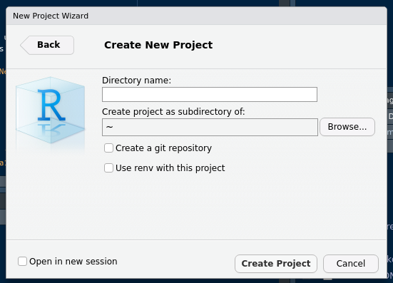

# Introdução ao R

```{r global_options, include=FALSE}
knitr::opts_chunk$set(fig.width=12,
                      fig.height=8,
                      warning=FALSE,
                      message=FALSE,
                      eval=FALSE)
```

## Leituras recomendadas

!!! highlight \"Leituras Recomendadas\"

    - __Capítulos 1, 2 e 3 (Parte 1)__. _Grolemund, Garret. Hands-On Programming with R_ -    [Livro](https://rstudio-education.github.io/hopr/r-objects.html)

    - __Capítulo 5 (Parte 2)__. _Grolemund, Garret. Hands-On Programming with R_ -  [Livro](https://rstudio-education.github.io/hopr/r-objects.html)

    - __Capítulos 2, 3 e 4__. _Aquino, Jakson. R para Cientistas Sociais_ - [Livro](http://www.uesc.br/editora/livrosdigitais_20140513/r_cientistas.pdf)

## 1. O que é o R e o RStudio?

### 1.1. Linguagem de programação R

O __R__ é uma linguagem de programação que vem crescendo bastante nos últimos anos. Apesar de inicialmente ter como público estatísticos, ela é cada vez mais utilizada para análise de dados nas mais diferentes áreas. A flexibilidade trazido por uma inúmera quantidade de pacotes permite lidar não só com tabelas estilo Excel, mas também com texto, imagens, etc.

Porém, podemos nos sentir intimidados quando vemos o __R__ pela primeira vez. Quando baixamos o __R__ pela primeira vez nos assustamos com a sua interface.


### 1.2. RStudio

Contudo, não se assuste. No geral, utilizamos o __RStudio__ para criar os nossos
_scripts_ de R, que contêm o passo-a-passo das nossas análises. RStudio é conhecido como
uma IDE (Ambiente de Desenvolvimento Integrado) e facilita a gestão de projetos escritos
em R, com seções específicas para cada funcionalidade.


__A - Console__: Local na qual temos o console do R. No console, podemos executar
os comandos que iremos ver logo a frente. Além disso, é o local no qual os resultados 
de nossos comandos irão aparecer.
    
__B - File/Plots/Help__: Nesta seção podemos ter acesso às pastas que estamos utilizando durante as nossas rotinas no R, além de visualizar os gráficos gerados a partir das análises e verificar a documentação de funções e pacotes, que explicaremos em breve.
    
__C - Workspace__: Os valores gerados no R, como por exemplo, variáveis e tabelas que você definiu irão aparecer aqui, sobretudo, na aba _Environment._ E o histórico de códigos rodados na aba _History._ Veremos nas próximas aulas que a aba _Connections_ é útil caso estejamos conectados com alguma base de dados externa, como por exemplo, Access ou PostgreSQL.
    
__D - Editor__: Seção na qual iremos passar a maior parte do nosso tempo. Nela, 
escrevemos os nossos _scripts_. _scripts_ são arquivos de texto que contêm o nosso
código R. 

Não se preocupe caso tenha achado um pouco confuso, vamos escrever algumas linhas de código
e você irá se familiarizar com o processo conforme tentar por você mesmo!

### 1.3. Nosso primeiro projeto

Recomendamos você sempre começar um projeto criando um projeto (dãã). Isso é essencial
e nos ajuda a evitar ter vários _scripts_ espalhados pelo nosso computador. 

Clique em `File -> New Project -> New Directory -> New Project`



### 1.4. Nosso primeiro _script_

No canto superior esquerdo, clique em `File →  Open file`. Repare que isso irá 
criar uma aba `Untitled1`. Vamos salvá-la como `Aula1.R`. Para isso, pressione
`Ctrl + S` e digite `Aula1.R`

### 1.5. Algumas regras de boa conduta

1. Não escreva diretamente no console. Salve o seu código __sempre__ em um _script_.
Assim conseguimos ter acesso a todas as decisões tomadas durante uma análise e 
permitir com que uma outra pessoa também chegue nos resultados que obtivermos.

2. __Nunca__ sobreponha o banco de dados. Uma vez que você tem um _script_, 
não é preciso salvar as alterações já que você será capaz de reproduzir os 
resultados no futuro.

3. Comente o seu código com `#`. Lembre-se que outras pessoas irão ler o seu código
e que elas não fazem ideia do que passava na sua cabeça quando você tomou algumas decisões. 
Além disso, o seu eu do futuro irá agradecer um código bem documentado caso seja 
necessário revisitá-lo.

## 2. Nossas primeiras linhas de código

Uma das funcionalidades mais básicas do __R__ é realização de operações matemáticas. 
Se estamos digitando os comandos em um _script_, basta colocarmos o cursor do mouse 
na linha do código e apertar `Ctrl + Enter` e o resultado sairá no Console, assim
como já havíamos mencionado.

```{r}
3 + 1 # Soma

3 - 2 # Subtração

4 * 2 # Multiplicação

5 / 2 # Divisão
```

### 2.1. Objetos e Atribuições
!!! cite \"\"

    "To understand computations in R, two slogans are helpful:
    
    • Everything that exists is an object.
    
    • Everything that happens is a function call."
    
    — John Chambers

Dados são guardados dentro de objetos.

- Objetos possuem diferentes formas de __estruturar__ os dados:

  + Vetores

  + Listas 

  + DataFrames

- Objetos podem conter diferentes __tipos__ de dados:

  + Números

  + Strings

  + Fatores

### 2.2. Atribuindo valores à variáveis (`<-`)

Quando fizemos as operações matemáticas, não salvamos os nossos resultados. Logo, caso quiséssemos acessar novamente, por exemplo, o resultado de `3 + 1`, seria necessário digitar novamente `3 + 1` e efetuar a operação. Contudo, é possível salvar os resultados em variáveis e, ao fazer referência a essas variáveis, obter outro resultado.

```{r}
3 + 1

a <- 3 + 1

c <- a * 2

# Qual o valor de C?

b <- c("Olá mundo!")

b

# Qual o valor de B?

vetor <- c(1, 2, 3, 4, 5, 6)

vetor
```

### 2.3. Tipos de dados

<center>

</center>
<center>
*Tipos de Dados no R (Fonte: https://www.wikitechy.com)*
</center>

#### 2.3.1. Variáveis do tipo numérico

De certa maneira, estamos muito acostumados com esse tipo de dados. Você consegue pensar em algum exemplo? 

- Os minutos passados entre o momento que você saiu de casa e chegou nesta sala de aula.

- Renda mensal da sua família.

- Quantidade de livros que você possui.

Pras pessoas curiosas, tipos numéricos podem ser divididos em __inteiros__ (_integers_) e __reais__ (_float_). Diferentemente de outras linguagens de programação, você dificilmente terá que se preocupar com isso no R. 

```{r}
3 # numero inteiro

55.4 # numero real
```

#### 2.3.2. Lidando com variáveis do tipo `string` (texto)

!!! note \"\"

    No R, não há diferença entre variável do tipo `char` e do tipo `string`. Todos são conhecidos como variáveis do tipo `character`.

Outro tipo de variável muito conhecida é o texto ou _string_. Para declaramos um texto no R podemos utilizar aspas simples (`''`) ou aspas duplas (`""`), mas lembre-se __não__ podemos intercalar as aspas, como por exemplo, `'olá mundo"`. Se começar um texto com aspas simples termine com aspas simples.

```{r}
"Vargas"
```

```{r}
'Jânio Quadros'
```

```{r}
"1945"
```

Perceba que devido ao fato de 1945 estar entre aspas, ele não é mais um dado do tipo número, mas sim texto e sim isso é totalmente diferente de escrever apenas `1945`.

#### 2.3.3. Lidando com variáveis do tipo `factor` (variáveis categóricas)

Vamos supor que estamos trabalhando com dados de _survey_ e em uma das questões temos a _escala likert_, em que as respostas vão do "Discordo totalmente" até o "Concordo totalmente" contabilizando um total de 6 categorias de resposta. Ocorre que para que o __R__ entenda este tipo de dado como algo categórico, precisamos transformá-los em fatores (_factors_).

Para fazer essa transformação, utilizaremos uma função chamada `factor()` que recebe como parâmetro um vetor com o que queremos transformar em categorias.

```{r}
factor(c("Discordo totalmente", "Discordo parcialmente", "Indiferente", "Concordo parcialmente", "Concordo totalmente"))
```

Diferente de quando executamos um dado tipo texto, os dados categóricos apresentam os níveis das categorias (`levels`). Perceba que as nossas categorias não estão de acordo com o que a escala _likert_ pressupõe e para arrumar este problema, precisamos definir os níveis através de um outro parâmetro da função `factor()` chamado `levels = `.

```{r}
factor(c("Discordo totalmente", "Discordo parcialmente", "Indiferente", "Concordo parcialmente", "Concordo totalmente"),
       levels = c("Discordo totalmente", "Discordo parcialmente", "Indiferente", "Concordo parcialmente", "Concordo totalmente"))
```

Pode parecer um pouco confuso agora, mas iremos esclarecer estes pontos nos próximos tópicos.

#### 2.3.4. Lidando com data e tempo

Muitas vezes precisamos lidar com data, como por exemplo, filtrar nossa análise em um intervalo de tempo. Porém, números e textos não são suficientes para entender as regras impostas pelas datas, como por exemplo, "01/01/2019" é mais recente que "31/12/2018".

```{r}
Sys.Date()
```

Parece uma variável texto, não? Porém se aplicarmos a função `class()`, que serve para verificarmos o tipo de uma variável, podemos ver que se trata de uma variável do tipo `Date`. Nem sempre teremos que nos preocupar com isso, mas caso você esteja querendo _plotar_ uma série temporal essa transformação é bem importante.

```{r}
class(Sys.Date())
```


!!! note \"Curiosidade\"
    Caso você tenha ficado curiosa, por baixo a variável `Date` é do tipo numérico e, por convenção, nada mais é do que a quantidade de segundos passados desde 1 de Janeiro de 1970.

#### 2.3.5. Lidando com lógicos/booleanos

Valores booleanos são resultados de operações booleanas e podem ser definidos como __verdadeiros__ ou __falsos__. Por convenção, trabalhamos com os termos em inglês. Portanto, __TRUE__ ou __FALSE__.

Por operações booleanas, podemos pensar em diferentes testes que tenham __necessariamente__ uma resposta ou verdadeira ou falsa. Por exemplo, 3 é maior do que 1? Verdadeiro! E 3 é menor do que 2? Falso! 

Vamos realizar essas duas operações no R.

```{r}
# 3 é maior do que 1?
3 > 1
```

```{r}
# 3 é maior do que 1?
3 < 2
```

Existem, obviamente, outras operações. É possível também testar a igualdade entre dois valores com `==`.

```{r}
# 2 é igual a 2?
2 == 2
```

Também podemos testar se dois valores são diferentes.

```{r}
#120 é diferente de 20?
120 != 20
```

Outras variações utilizadas são o maior ou igual (`>=`) e o menor ou igual (`<=`). Além disso, também é possível realizar essas operações com textos.

```{r}
# "FFLCH" é igual a "ICB"?
"FFLCH" == "ICB"
```

!!! question \"Qual texto é maior?\"
    Na sua opinião, qual é o resultado de `"Acre" > "São Paulo"`?
    
Na prática, podemos utilizar essas operações para filtrar o nosso banco de dados. Imagine, por exemplo, que você possui um banco de dados das eleições municipais realizadas no Brasil em 2020, mas que quisesse apenas o resultado do Rio de Janeiro. 
Mediante uma operação booleana, podemos fazer algo como `cidade == "Rio de Janeiro"` e selecionar apenas o resultado dessa cidade.

#### 2.3.6. Valores Ausentes ou Missing

O que são _missing_ e por que existe um valor especial para eles? _Missing_ representam valores desconhecidos. Imagine que, durante uma pesquisa sobre preferência política, a pessoa entrevistada se recusa a responder a pergunta "Você votou na última eleição?". O fato dela se recusar não significa que ela não tenha votada. Nós simplesmente não sabemos e precisamos representar isso nos nossos dados para tratarmos esses casos eventualmente.

!!! note \"Tipos de _missing_\"

    Existem dois tipos de valores missing, o `NA` (_not available_) e o `NaN` (_not a number_), ambos 
    tem sentidos semelhantes, porém o primeiro é mais genérico para cada tipo de dado. 

Para sabermos se um certo dado é _missing_, utilizamos a função `is.na()`.

```{r}
is.na(NA)

is.na(99)
```

Por que esse código retorna `NA`?

```r
NA == NA
```

## 3. Exercícios - Parte 1

### 3.1. Tipos de Dados

Quais os tipos de cada variável apresentada abaixo?

!!! warning ""
    Caso apareça "+" no seu console ao testar as afirmações, basta apertar "Esc"

1. `33.5`

2. `20`

2. `"Olá mundo!"`

3. `factor("oi", levels = c("oi", "tchau"))`

4. `TRUE`

5. `FALSE`

### 3.2. Encontre o erro

Verifique se as expressões abaixo são válidas ou não. Caso não sejam, reescreva-as de maneira que sejam válidas.

!!! warning ""
    Caso apareça "+" no seu console ao testar as afirmações, basta apertar "Esc"

1. `22,2`

2. `'O 'R' é uma linguagem legal"`

3. `"O 'R é uma linguagem legal"`

4. `"O 'R é uma linguagem legal'`

## 4. Estruturas de dados

As estruturas de dados são maneiras de organizar e guardar dados dentro da linguagem para que possamos trabalhar de forma mais eficiente. No nosso cotidiano utilizaremos três destas estruturas: __vetores__ e __dataframes__.


### 4.1. Vetores (atômicos)

Um vetor atômico é a estrutura mais básica no R; é um vetor de dados homogêneo com apenas uma dimensão. Imagine o vetor como um trem cujos valores estão ordenados e são __obrigatoriamente__ do mesmo tipo (`numeric`).

<br/>

<center>

</center>
<center>
_Ilustração de um trem_
</center>

<br/>

Que tal um exemplo? Imagine que você queira organizar em um vetor a quantidade de pessoas dentro de vagões de um trem. Nesse sentido, a quantidade de pessoas no primeira vagão é seguida da quantidade de pessoas no segundo e assim por diante.

```{r}
c(120, 29, 191, 18, 39)
```

Quantas pessoas estão no segundo vagão? 29? Acertou!

Perceba então que para construir um vetor basta colocarmos os valores dentro de `c()`.

#### 4.1.1. Indexando vetores

!!! warning ""
    Se você tem experiência com programação, o R é diferentão dentro desse mundo. Todas as estruturas são indexadas a partir do valor `1`, ou seja, para acessar o primeiro valor de um vetor, você executará algo como `vetor[1]`.

Podemos acessar os valores específicos de um vetor a partir da posição dele nessa estrutura. No exemplo anterior, você poderia ter pedido para o R lhe retornasse quem está na segunda posição. Para isso, basta utilizar `trem[2]` como no exemplo a seguir.

```{r}
trem <- c(120, 29, 191, 18, 39)

trem[2]
```

Para indexarmos mais de um elemento podemos indexar de duas formas. Logo se quiséssemos o número de pessoas no terceiro e quarto vagão:

```{r}
trem[c(3,4)]

trem[3:4]
```

O que acontece se você utilizar `[3:5]`?

```r
trem[3:5]
```

### 4.2. Dataframes

O __dataframe__ é semelhante a uma planilha de Excel ou Google Sheets. Ela é uma representação feita dentro do R 
para estruturas que possuem linhas e colunas. As colunas, no geral, serão as nossas variáveis, as informações sobre uma determinada unidade observacional (pessoas, estados, países, etc.), enquanto cada linha representa uma observação. Por exemplo, caso fizéssemos um __dataframe__ com informações sobre os países do mundo, cada linha seria um país e cada coluna uma informação sobre esse ele.

```{r}
tabela <- data.frame(ano = c(2014, 2014, 2015, 2015, 2016, 2016),
                     pais = c('Brasil', 'China', 'Brasil', 'China', 'Brasil', 'China'),
                     pib = c(100,130, 110, 140, 160, 170),
                     pop = c(3, 8, 4, 9, 6, 14))

tabela
```

Diferentemente do Excel, não podemos selecionar uma célula e alterar um dado. No R, para manipular e visualizar uma tabela precisamos utilizar funções. Não se estresse caso nunca tenho ouvido falar delas. Pense apenas que elas realizam alguma __ação__.

Repare nos resultados das funções a seguir:

```{r}
View(tabela) # mostra o banco no console

head (tabela) # mostra as seis primeiras linhas do banco no console

str(tabela)# mostra a estrutura da tabela

names(tabela) # mostra o nome das variáveis

nrow(tabela) # nº de linhas

ncol(tabela) #nº de colunas

dim(tabela) # dimensões
```

#### 4.3.1. Indexando 

Para indexar __dataframes__, você precisa levar em conta a característica bidimensional dessa estrutura de dados. Uma `tabela` será indexada com `tabela[linha, coluna]`.

```{r}
tabela[1, 2] # Primeira linha, segunda coluna
```

```{r}
tabela[1,] # Primeira linha, todas as colunas

tabela[,1] # Todas as linhas, primeira coluna

tabela[1:3,] # Linhas de 1 até 3, todas as colunas

tabela[,2:4] # todas as linhas, colunas de 2 até 4
```

Como __dataframes__ possuem colunas e as colunas, nomes, podemos utilizar o nome das colunas para selecioná-las.

```{r}
tabela[,"pais"] # Todas as linhas da coluna "pais"

tabela[2,"pais"] # O valor da segunda linha e da coluna "pais"

tabela[, c("pais", "pib")] # Todas as linhas das colunas "pais" e "pib"
```

Por fim, também podemos indexar utilizando o operador `$` seguido do nome da coluna.

```{r}
tabela$pib

tabela$pib[1]
```

#### 4.3.2. Importando dataframes (csv, Excel, etc.)

Uma das maneiras mais eficientes de se importar dados para o R é pelo uso dos seguintes pacotes:

1. `readr` para a leitura de CSVs.

2. `readxl` para a leitura de planilhas de Excel.

3. `haven` para a leitura de arquivos.

!!! warning \"Instalando pacotes do R\"

    O R não possui todos os pacotes previamente. Em geral, utilizaremos o comando `install.packages()` 
    para instalar pacotes no R. Execute o comando `install.packages(c('readr', 'readxl', 'haven'))`.
    Lembre-se de carregar o pacote no R com o comando `library()`. Por exemplo, `library(readr)`.
    
Você sabia que o TSE (Tribunal Superior Eleitoral) libera diversos dados sobre as eleições no site deles?

Que tal tentar baixar o banco de candidatos? Para isso, baixe os arquivos:

- [Candidatos - CSV](https://github.com/p4hUSP/material-2021/raw/master/docs/data/candidatos_sp_virgula.csv) 

- [Candidatos - CSV2](https://github.com/p4hUSP/material-2021/raw/master/docs/data/candidatos_sp_pontovigula.csv) 

- [Candidatos - TAB](https://github.com/p4hUSP/material-2021/raw/master/docs/data/candidatos_sp_tab.csv) 

- [Candidatos - Arroba](https://github.com/p4hUSP/material-2021/raw/master/docs/data/candidatos_sp_arroba.csv) 

- [Candidatos - Excel](https://github.com/p4hUSP/material-2021/raw/master/docs/data/candidatos_sp_excel.xlsx) 

- [Candidatos - Stata](https://github.com/p4hUSP/material-2021/raw/master/docs/data/candidatos_sp_stata.dta) 

Às vezes, o navegador não irá fazer o download automaticamente (normalmente isso ocorre no Firefox) e lhe mostrará uma tela repleta de caracteres. Calma! Clique com o botão direito na tela e selecione a opção __Save Page As...__. Recomendamos que você salve os dados dentro de uma pasta chamada __data__ ou __dados__ para manter o projeto organizado.

Para importar um CSV para o R, utilize a função `read_csv()` do pacote `readr`.

!!! warning \" Fique atento com o lugar que você salvou os arquivos! \"

    Neste exemplo, os arquivos estão salvos dentro da pasta __data__.
    
<br/>

```r
library(readr)

banco_virgula <- read_csv('data/candidatos_sp_virgula.csv')
```

Se tudo tiver dado certo, agora você terá um `banco_virgula` no seu ambiente de variáveis. Mas nem sempre um banco de dados é separado por vírgula e mesmo assim ele pode ter a extensão `.csv`.

- Bancos separados por ponto e vírgula `;`.

```r
banco_pontovirgula <- read_csv2('data/candidatos_sp_pontovirgula.csv')
```

- Banco separados por tabs `\t`.

```r
banco_tab <- read_tsv('data/candidatos_sp_tab.csv')
```

- Banco separados por `@` ou qualquer outro `caractere`.
```r

banco_arroba <- read_delim('data/candidatos_sp_arroba.csv', delim = '@')
```

- Banco Excel.

```r
library(readxl)

banco_excel <- read_excel('data/candidatos_sp_excel.xlsx')
```

!!! warning \" Repare que o número de linhas do banco Excel é menor! \"

<br/>

Por que isso aconteceu?

- Banco Excel - Abas
```r
library(readxl)

banco_excel_1 <- read_excel('data/candidatos_sp_excel.xlsx', sheet = 1)

banco_excel_1 <- read_excel('data/candidatos_sp_excel.xlsx', sheet = 2)
```

- Banco Stata
```{r}
library(haven)

banco_stata <- read_stata('data/candidatos_sp_stata.dta')
```


## 5. Exercício - Parte 2

### 5.1. DataFrames

1. Crie um dataframe com o "nome", "idade" e "filme" preferido dos seus colegas de turma.

!!! question \" Como criar um dataframe? \"
    
    Lembre-se que para criar um dataframe utilizamos a função `data.frame()` e que essa função recebe vetores 
    como parâmetros para cada coluna que desejamos criar. Por exemplo, se você quiser criar uma dataframe com
    uma lista de números basta executar `data.frame(lista_numeros = c(1,2,3,4,5,6,7))`

2. No R temos, bancos para fins didáticos. Para utilizá-los basta usar a função data. Para esse exercícios utilizaremos o banco mtcars. Execute `data(mtcars)`. Repare que agora você pode acessar o banco `mtcars` da mesma maneira que fizemos anteriormente com outros dataframes.

    - Visualize o banco. Do que se trata?

    - Quais são suas variáveis?

    - E suas dimensões?

    - Selecione as 10 primeiras observações

## 5. Funções

Como você deve ter notado mencionamos algumas vezes a palavra função durante o texto. Mas o que é isso? Podemos pensar cada função como uma __ação__. Por exemplo, imagine você possa controlar a sua vida por meio de __funções__. Se as coisas funcionam assim, provavelmente teríamos uma função `levantar()`, `beber_aguar()` e assim por diante. No R, o princípio é o mesmo e precisamos utilizar funções para executar quaisquer comandos que precisamos que sejam operados. Por exemplo, quando você executou `read_csv()`, você chamou um código que abre o arquivo especificado e estrutura cada linha dentro de um dataframe. 

Mas como uma função sabe sobre onde ela precisa operar? Como `read_csv()` sabia que precisava abrir aquele arquivo? Para isso, utilizamos __parâmetros__. Parâmetros alteram o comportamento das nossas funções e nos permitem especificar, por exemplo, um arquivo para a `read_csv()` escrevendo `read_csv('arquivo.csv')`.

Vamos ver isso na prática com outra função bastante importante, a `mean()`. 

!!! question \" Como aprender a utilizar funções? \"

    Obviamente, você pode utilizar o Google, mas muitas vezes não é necessário sair do RStudio. 
    Se você quiser, utilize o comando `?mean` e tente ler a documentação e os exemplos.
    Pacotes instalados pelo CRAN necessariamente são acompanhados por uma documentação que explica
    o que as suas funções fazem.


Vamos tentar rodar um exemplo?

```r
x <- c(1,2,3)
xm <- mean(x)

xm
```

A função `mean()` calcula a média de qualquer vetor numérico para a gente e podemos utilizar para ter uma noção dos nossos dados durante uma análise.

### 5.1. Pacotes
                                                                   
Segundo a definição do livro R Packages, escrito por Hadley Wickham, um pacote é uma unidade fundamental de compartilhamento de códigos, dados, documentação e testes. Em outras palavras, os pacotes são coleções de códigos (funções) e dados desenvolvidos pela comunidade.
                                                                   
Estes pacotes ficam localizados no que chamamos de repositório. O principal repositório recebe o nome de **C**omprehensive **R** **A**rchive **N**etwork, o também chamado, CRAN. Mas existem outros também, como o Github, no qual a forma de obter os pacotes muda. Para instalar um pacote, utilize o comando `install.packages()` em que o argumento principal é o nome do pacote que queremos instalar.
                                                                   
Uma peculiaridade desta função é que por padrão ela instala os pacotes que estão no CRAN, como por exemplo, vamos instalar um pacote chamado "dplyr"
                                                                   
```{r}
install.packages("dplyr")
```
                                                                   
Após instalarmos o pacote, devemos habilitá-lo com uma função chamada `library()`
                                                                   
```{r}
library(dplyr)
```


Caso o pacote não esteja no CRAN, mas sim no Github, devemos instalar o pacote com o auxilio de uma função chamada `install_github()` do pacote `devtools`.
                                                                   
```{r}
install.packages("devtools")
                                                                   
library(devtools)
```

!!! question \" Pacotes no GitHub \"

    Caso o seu pacote não esteja liberado no CRAN ou caso deseje ter acesso à versão de 
    desenvolvimento, você irá precisar utilizar a função `install_github()` do pacote `devtools`
    que recebe como parâmetro `<dono-do-pacote>/<nome-do-pacote>`. Por exemplo, `install_github("abjur/abjutils")`.
    Não se esqueça de habilitar o `devtools` com a função `library(devtools)`.

## 6. Controladores de Fluxo

É muito comum estabelecermos uma condição para tomar uma decisão, como por exemplo, 'Porcentagem de votos maior que 50% pode significar vitória, caso contrário, derrota'.

Para que possamos fazer isso, utilizaremos o `if/else` e o `for`!

### 6.1. if/else

A estrutura do if/else é a seguinte:

```r
if(<condicao>){
  <comando1>
  <comando2>
  <etc>
}else{
  <comando3>
  <comando4>
  <etc>
}
```

Podemos interpretá-la da seguinte maneira: Se a condição for verdadeira, execute os comandos 1 e 2, caso contrário, execute os comandos 3 e 4.

### 6.2. for

```r
for (i in x){
  <comando1>
  <comando2>
}
```

Nós lemos o `for` acima da seguinte maneira: __Para cada valor "i" presente na sequência "x", realize tais comandos. Ou seja, para cada linha da nossa tabela, some um ao percentual de votos recebidos.__

Vamos criar o seguinte `dataframe`:

- `ano`: ano da observação.
    
- `pais`: país da observação.
    
- `pip`: Produto Interno Bruto do país.

- `pop`: População do país.
    
```{r}
tabela <- data.frame(ano = c(2014, 2014, 2015, 2015, 2016, 2016),
                     pais = c('Brasil', 'China', 'Brasil', 'China', 'Brasil', 'China'),
                     pib = c(100,130, 110, 140, 160, 170),
                     pop = c(3, 8, 4, 9, 6, 14))
```

Nosso objetivo: 

> Criar uma terceira coluna com o _PIB per capta_ com um `for`
    
```{r}
for(i in 1:nrow(tabela)){
  print(tabela$pib[i])
} 
```

Vamos entender algumas coisas aqui,

- `nrow(tabela)` é uma função que retorna o número de linhas de uma tabela, ou seja, seu resultado é um número.

- Quando temos `1:nrow(tabela)`, estamos criando um vetor com uma sequência de 1 até o número de linhas da nossa tabela, no caso, 6. Isso significa que nosso `for` vai percorrer as treze linhas da tabela.

- Uma vez que o `i` assumirá os valores de 1 até 6, podemos indexar o vetor `tabela$pip[i]` com o `[i]` para obter o número do PIB correspondente a linha `i`. Dessa maneira podemos dividir `tabela$pip[i]` pela `tabela$pop[i]` e obter a _renda per capta.

Vamos agora voltar ao nosso objetivo principal: 

```{r}
tabela$pib_capta <- NA # Criando uma coluna vazia

for(i in 1:nrow(tabela)){
  tabela$pib_capta[i] <- tabela$pib[i] / tabela$pop[i]
}

print(tabela)
```

Por fim, nós podemos misturar o `for` com o `if` para obter um comportamento customizável dentro do nosso _loop_.

Por exemplo, vamos criar uma classificação de PIB _per capta_ entre alto e baixo. Para isso, iremos utilizar o 20 como o discriminador entre essas duas classes. Nesse sentido, se `pib_capta` for maior do que 20 devemos classificar 

```{r}
tabela$pip_capta_class <- NA # Criando uma coluna vazia

for(i in 1:nrow(tabela)){
  if(tabela$pib_capta[i] > 20){
    tabela$pip_capta_class[i] <- 'Alto'
  } else {
    tabela$pip_capta_class[i] <- 'Baixo'
  }
}

print(tabela)
```


!!! highlight \"    __PARABÉNS!!!__ :tada: :tada: :tada: \"

    Enfim, após esse breve resumos de conceitos básicos de programação você será capaz de interagir com
    pacotes com uma vasta variedade de pacotes, além de conseguir desenvolver as próprias soluções
    quando for necessário.

## 7. Exercícios

### Exercício 1 - Tipos de dados

Execute os códigos abaixo e verifique se são dados válidos em R. Caso verdadeiro, informe o tipo de dado:

Obs: Caso apareça "+" no seu console ao testar as afirmações, basta apertar "Esc"

1. `33,5`

2. `"Olá mundo"`

3. `"O 'R' é uma linguagem legal"`

4. `"O 'R é uma linguagem legal"`

5. `"O 'R é uma linguagem legal'`

6. `400e + 10`

7. `factor("oi", levels = c("oi", "tchau"))`

8. `true`

9. `False`

### Exercício 2 - Manipulando variáveis

1. Altere o valor de `v_numero` para 42

```r
v_numero <- 42.5
```

2. Altere o valor de `v_caractere` para "universo".

```r
v_caractere <- "algum texto"`
```
3. Altere o valor de `v_logical` para FALSE

```r
`v_logical <- TRUE`
```

### Exercício 3 - Estruturas de Dados

1. Crie dois vetores:

    - O primeiro (`nome`) deve conter o nome de pelo menos 5 colegas que estão sentandos ao seu redor.
    
    - O segundo (`altura`) deve conter a altura desses colegas.
    
```r
vetor_nome <- c()
vetor_altura <- c()
```

2. Acesse o primeiro nome do `vetor_nome`. Lembre-se que você precisa dos `[]`.

3. Acesse os primeiros três valores de altura no `vetor_altura`. 

  - Faça isso apenas utilizando `[]` e `:`
  
  - Faça isso apenas utilizando `[]` e `c()`
  
4. Crie um `dataframe` a partir de `vetor_nome` e `vetor_altura`.

```r
tabela_colegas <- data.frame(nome = <completar>,
                             altura = <completar>)
```
3. Usando a __indexação__, obtenha:
    
    - O vetor `nome` dentro do dataframe `tabelas_colegas`
  
    - O vetor `altura` dentro do dataframe `tabelas_colegas`
  
    - Obtenha a primeira observação da sua tabela (primeira linha)

4. Utilizando funções obtenha:

    - A média de altura dos seus colegas

    - Uma tabela (`table()`) dos nomes dos seus colegas

    - O desvio padrão da altura (`sd()`)

### Exercício 4 - Controladores de Fluxo

1. Imprima todas as alturas de `tabelas_colegas` com `for` e `print()`.

2. Crie uma classificação para a altura dos seus colegas com `for` e `if`. Não se preocupe com o valor utilizado. Contudo, case deseje, você pode dividi-los pela __mediana__ ou pela __média__.

### Exercício 5 - Importação de Dados

1. Escolha um dos bancos abaixo ou qualquer outro de seu interesse. Baixe o banco, utilize as funções para explorar as variáveis, retire algum resumo de uma variável (média, contagem, etc.).

!!! question \" Relembrando as funções \"

    Você pode utilizar `View()`, `head()`, `str()`, `names()`, entre outras para ter uma ideia geral do banco de dados.
    Para extrair estatísticas, você pode utilizar `mean()`, `sd()`, `median()`, etc.
    
    Lembre-se que o Google é o seu melhor amigo! Pesquisa outros comandos que sejam do seu interesse!

<center>

| Banco  | Link     |
|--------|----------|
| Banco Eleições  | [Download](http://www.tse.jus.br/eleicoes/estatisticas/repositorio-de-dados-eleitorais-1/repositorio-de-dados-eleitorais)
| Preço Médio de Combustíveis no Brasil | [Download](https://www.kaggle.com/matheusfreitag/gas-prices-in-brazil)
| Banco de Pokemon | [Download](https://www.kaggle.com/rounakbanik/pokemon)
| Vagas de Emprego em Nova Iorque | [Download](https://www.kaggle.com/new-york-city/new-york-city-current-job-postings)

</center>

### Exercício 6 - Desafio

Com o banco de dados do exercício anterior tente levantar algumas hipóteses sobre as relações de variáveis. Por exemplo, "eu acho que X causa Y". Anote todas essas hipóteses.

Uma vez feito isso, tente:

1. Criar um gráfico que ressalte a relação entre essas variáveis.

2. Procure rodar um teste estatístico que ponha à prova a sua hipótese (Teste t, ANOVA, regressão linear, regressão logística, etc.).

!!! question \" Por onde começar? \"

    Existe um pacote de visualização de dados muito famoso para o R chamado `ggplot2`. 
    Quanto ao teste estatístico, o R possuí todos os testes citados implementados, ou seja, você não 
    precisa baixar um pacote para aplicá-los. Tente procurar na _internet_. Existem referências tanto
    em [português](https://paternogbc.github.io/guia_ggplot2/grafico-de-barras.html) quanto em
    [inglês](https://r4ds.had.co.nz/data-visualisation.html).

