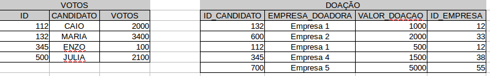

```{r global_options, include=FALSE}
knitr::opts_chunk$set(fig.width=12,
                      fig.height=8,
                      warning=FALSE,
                      message=FALSE,
                      eval=FALSE)
```

# dplyr e seus verbos

Para tornar a manipulação de dados mais eficiente, foi criado um pacote chamado de dplyr que possui uma série de ferramentas para filtrar, selecionar e sumarizar informações, como veremos a seguir. Iremos ver duas características importantes deste pacote, os "verbos" e os 'joins'.

## Verbos

Os principais verbos do dplyr são:

1. `filter`: filtra as linhas de um banco de dados de acordo com uma regra lógica.

2. `select`: seleciona as colunas de interesse.

3. `mutate`: modifica ou cria colunas de acordo com valores fornecidos.

4. `count`: conta os valores de uma variável.

    + Especialmente útil para variáveis categóricas.
    
5. `rename`: altera o nome das variáveis (colunas). 
    
6. `group_by` e `summarise`: são funções normalmente utilizadas em conjunto. Elas permitem realizar operações de agregações com o banco de dados e, assim, alterar a nossa unidade de análise. 

Porém, não ficaremos apenas nestes verbos, veremos também algumas de suas variações e conheceremos o famoso `%>%` (pipe).

Como vimos, o dplyr é um pacote essencial para manipulação de dados e uma das suas vantagens é que a forma como aplicamos suas funções segue o seguinte padrão:

`funcao_dplyr(banco_de_dados, argumentos_especificos)`

Ou seja, o primeiro argumento de qualquer um dos verbos é o banco de dados, seguido de argumentos específicos de cada função, como por exemplo, qual variável criar ou filtrar.

### `filter()`

Quando estamos fazendo algumas análises, é comum encontrarmos observações que não nos interessam, como por exemplo, se estou fazendo uma análise sobre candidatos de São Paulo, espero que na minha base de dados tenham apenas candidatos percentences a esta unidade federativa. Para isso utilizamos o `filter()`, vejamos o exemplo abaixo:

```{r}
filter(candidatos, SG_UF == "SP")
```

Lembra quando vimos operadores lógicos? Pois bem, eles são muito utilizados no `filter()`. Caso o nosso interesse seja não apenas filtrar os candidados de SP, mas também os candidatos à prefeitura adicionamos o nome da variável, seguido do condicional

```{r}
filter(candidatos, SG_UF == "SP", DS_CARGO == "PREFEITO")
```

E se além dos filtros propostos também quisermos separar os candidatos com grau de instrução igual ao superior completo e incompleto? Para fazer esse filtro podemos utilizar o operador `%in%`! Ele basicamente nos ajuda a filtrar mais de um tipo de categoria de uma variável, uma vez que o operador `==` compara apenas uma categoria.

```{r}
filter(candidatos, SG_UF == "SP", DS_CARGO == "PREFEITO", DS_GRAU_INSTRUCAO %in% c("SUPERIOR COMPLETO", "SUPERIOR INCOMPLETO")) # perceba a importancia de colocar as categorias que serao filtradas dentro de um vetor
```

Vamos aproveitar para filtar os casos em que os Prefeitos concorram em agremiações diferentes de partidos isolados e guardar esse dado em um objeto chamado `pref_sup_SP`.

```{r}
pref_sup_SP <- filter(candidatos, SG_UF == "SP", DS_CARGO == "PREFEITO", DS_GRAU_INSTRUCAO %in% c("SUPERIOR COMPLETO", "SUPERIOR INCOMPLETO"), TP_AGREMIACAO != "PARTIDO ISOLADO")
```

Agora temos uma outra base de dados para analisarmos. Vamos conhecer então o `select()`.

### `select()`

Em muitas situações nós não trabalhamos com todas as variáveis do banco de dados; para removermos aquelas colunas que não iremos utilizar, adotamos a função `select()`. Vamos selecionar apenas o nome dos candidatos e o número deles.

```{r}
select(pref_sup_SP, NM_CANDIDATO, NR_CANDIDATO)
```

Percebeu o padrão dessa função? Basicamente é o banco de dados e as variáveis que queremos selecionar. Mas e se quisermos retirar variáveis?

```{r}
select(pref_sup_SP, -NM_CANDIDATO, -NR_CANDIDATO)
```

No exemplo acima estamos retirando as variáveis NM_CANDIDATO e NR_CANDIDATO colocando um `-` na frente dessas variáveis.

Além disso, podemos utilizar funções auxiliares para selecionar as colunas, como por exemplo, selecionar toda variável que começa com NR ou termina com ELEICAO.

```{r}
# starts_with: selecione as colunas que comecam com NR
select(pref_sup_SP, starts_with("NR"))

# ends_with: selecione as colunas que terminam com ELEICAO
select(pref_sup_SP, ends_with("ELEICAO"))

# contains: selecione as colunas que contem a palavra CANDIDATO
select(pref_sup_SP, contains("CANDIDATO"))
```

Para darmos continuidade aos outros verbos vamos retirar algumas variáveis

```{r}
pref_sup_SP <- select(pref_sup_SP, -DT_GERACAO, -HH_GERACAO, -NR_PROCESSO)
```

### `mutate()`

Caso tenhamos interesse em alterar ou criar uma variável, podemos utilizar o `mutate()`. Vamos aproveitar e:

- Alterar DT_NASCIMENTO_ANO para númerico

- Criar a variável IDADE_ATUAL como a diferença entre 2019 e DT_NASCIMENTO_ANO.

```{r}
pref_sup_SP <- mutate(pref_sup_SP, 
       DT_NASCIMENTO_ANO = as.numeric(DT_NASCIMENTO_ANO),
       IDADE_ATUAL = 2019 - DT_NASCIMENTO_ANO)
```

Simples não? Além disso, podemos criar variáveis categóricas, como por exemplo, uma variável que identifica se o candidato tem uma idade maior ou menor de 40.

```{r}
pref_sup_SP <- mutate(pref_sup_SP, CATEGORIA_IDADE = ifelse(IDADE_ATUAL <= 40, "MENOR QUE 40", "MAIOR QUE 40"))
```

Perceba que para criar essa variável utilizamos uma função chamada `ifelse()`. Basicamente esta função é um if que pergunta: Se a IDADE_ATUAL for menor ou igual à 40, classificamos como "MENOR QUE 40", caso negativo, "MAIOR QUE 40".

Agora que criamos a variável "CATEGORIA_IDADE", quantos candidatos têm uma idade menor de 40? Para respondermos isso podemos utilizar a função `count()`

### `count()`

Em uma tradução literal, o `count()` irá contar as categorias de uma variável.

```{r}
tabela_pref_40 <- count(pref_sup_SP, CATEGORIA_IDADE)
```

Portanto, podemos notar que existem mais candidatos maiores de 40 anos do que o contrário!

### `rename()`

Se quisermos renomear o nome das variáveis temos que utilizar o `rename()` que tem o seguinte padrão:

`rename(bando_de_dados, nome_novo = nome_antigo)`

```{r}
tabela_pref_40  <- rename(tabela_pref_40, Quantidade = n)
```

### `group_by()` e `summarise()`

O `group_by()` e `summarise()` são funções que trabalham, na maioria das vezes, juntas. Eles servem para sumarizar os dados de acordo com grupos, ou seja, a contagem que haviamos feito com o `count()` pode ser reproduzida aqui da seguinte forma:

```{r}
temp_1 <- group_by(pref_sup_SP, CATEGORIA_IDADE)

summarise(temp_1, Quantidade = n())
```

O objeto `temp_1` é uma tabela agrupada! Visualmente ela parece normal, porém qualquer operação feita nela será realizada de acordo com os grupos nos quais ela encontrou, que neste caso é: MAIOR QUE 40 e MENOR QUE 40.

Quando utilizamos o summarise, iremos agrupar as categorias em torno de uma estatística, no caso, a contagem. Para fazer isso, utilizamos a função `n()`, uma função utilizada para contar obervações. Caso a variável que fossemos sumarizar fosse númerica, poderiamos utilizar a média (`mean()`), mediana (`median()`) e assim por diante.

Portanto, a vantagem do `group_by()` e `summarise()` é que conseguimos sumarizar com outras estatísticas além da contagem. Vejamos o exemplo abaixo. Estamos agrupando pela categoria de idade e a cor/raça do candidato. Após isto, estamos contando o número de observações que apresentam estas categorias.

```{r}
temp_2 <- group_by(pref_sup_SP, CATEGORIA_IDADE, DS_COR_RACA)

summarise(temp_2, Quantidade = n())
```

Com isso podemos verificar que existem mais candidatos brancos entre os maiores e menores de 40 anos; e que não existe candidato indígena com menos de 40 anos, por exemplo.

### `%>%`

Até então, vimos os principais verbos do `dplyr` e conseguimos verificar que maior parte dos candidatos à prefeitura no Estado de São Paulo, que pertence à coligações e tem ensino superior completo e incompleto tem mais de 40 anos de idade. Porém, para fazer isso tivemos que criar diversas linhas de código, salvando várias vezes as saídas dentro de um mesmo objeto, algo que é muito trabalhoso.

Também poderíamos fazer igual ao código abaixo, porém a interpretação desse código se torna mais complexa, uma vez que as ações são realizadas de dentro pra fora.

```{r}
rename(count(mutate(select(filter(candidatos, SG_UF == "SP", DS_CARGO == "PREFEITO", DS_GRAU_INSTRUCAO %in% c("SUPERIOR COMPLETO", "SUPERIOR INCOMPLETO"), TP_AGREMIACAO != "PARTIDO ISOLADO"), -DT_GERACAO, -HH_GERACAO, -NR_PROCESSO), DT_NASCIMENTO_ANO = as.numeric(DT_NASCIMENTO_ANO),
       IDADE_ATUAL = 2019 - DT_NASCIMENTO_ANO, CATEGORIA_IDADE = ifelse(IDADE_ATUAL <= 40, "MENOR QUE 40", "MAIOR QUE 40")), CATEGORIA_IDADE), Quantidade = n)
```

Para solucionar este problema os desenvolvedores do pacote incluiram um operador chamado de pipe (`%>%`). Basicamente ele permite que possamos contruir códigos de forma linear, como podemos notar abaixo!

```{r}
candidatos %>% 
  filter(SG_UF == "SP", DS_CARGO == "PREFEITO", DS_GRAU_INSTRUCAO %in% c("SUPERIOR COMPLETO", "SUPERIOR INCOMPLETO"), TP_AGREMIACAO != "PARTIDO ISOLADO") %>% 
  select(-DT_GERACAO, -HH_GERACAO, -NR_PROCESSO) %>% 
  mutate(DT_NASCIMENTO_ANO = as.numeric(DT_NASCIMENTO_ANO),
         IDADE_ATUAL = 2019 - DT_NASCIMENTO_ANO,
         CATEGORIA_IDADE = ifelse(IDADE_ATUAL <= 40, "MENOR QUE 40", "MAIOR QUE 40")) %>% 
  count(CATEGORIA_IDADE) %>% 
  rename(Quantidade = n)
```

Agora podemos interpretar o código acima da seguinte maneira:

> Pegamos a nossa base de dados "candidatos", aplicamos um FILTER, em seguida o SELECT para removermos colunas que não queremos. Depois alteramos e criamos variáveis com MUTATE; contamos o número de observações de uma variável com o COUNT e por fim, mudamos o nome de uma variável com RENAME.

Você pode estar pensando: Mas que benefício eu tenho com o pipe? Ele otimiza o nosso tempo escrevendo o código, já que não precisamos escrever os objetos para sobrescrever às saídas e também diminui a complexidade do código.

Caso tenha interesse em saber mais sobre as origens do `%>%` [Clique aqui!](https://www.datacamp.com/community/tutorials/pipe-r-tutorial#intro)

Em resumo, o pipe, quando utilizado com `dplyr` tem a seguinte estrutura:

1. Banco de dados

2. Operações de manipulação

## Joins

Muitas vezes precisamos combinar informações de tabelas diferentes para conseguir responder as nossas perguntas. Vejamos as tabelas abaixo:

```{r}

```

Estas duas tabelas são referentes à votos recebidos por um determinado candidato e às doações atreladas a esse mesmo candidato; elas são duas tabelas diferentes ligadas apenas pela variável "ID". Sendo assim, para conectá-las precisaremos fazer com que exista um match entre ID. Aqui entram os diferentes tipos de 'joins'.

Os `*_join()` nada mais são que funções que ajudam a combinar duas tabelas através de uma "variável de ligação", que normalmente costuma ser uma variável de identificação única da observação, como por exemplo, o CPF de um indivíduo.

```{r}
tbl_votos <- data.frame(ID = c("112", "132", "345", "500"),
                        CANDIDATO = c("CAIO", "MARIA", "ENZO", "JULIA"),
                        VOTOS = c(2000, 3400, 100, 2100),
                        stringsAsFactors = FALSE) # PARA EVITAR QUE OS DADOS SEJAM TRANSFORMADOS EM CATEGORICOS

tbl_empresas <- data.frame(ID_CANDIDATO = c("132", "600", "112", "345", "700"),
                           EMPRESA_DOADORA = c("Empresa 1", "Empresa 2", "Empresa 1", "Empresa 4", "Empresa 5"),
                           VALOR_DOACAO = c(1000, 2000, 500, 1500, 5000),
                           ID_EMPRESA = c("12", "33", "12", "38", "55"), 
                           stringsAsFactors = FALSE)
```

### `inner_join()`

O primeiro join que veremos é o `inner_join()`, que retorna a intersecção das tabelas `tbl_votos` e `tbl_empresas`, ou seja, a saída é uma nova tabela com informações em comum entre os dados. No caso exemplificado, o resultado são três observações em comum entre as tabelas dado o mesmo ID.

Perceba que para montar a função de join, precisamos de três argumentos:

- x: que aqui chamaremos de tabela à esquerda

- y: que aqui chamaremos de tabela à direita

- by: argumento que especifica qual é a variável de ligação entre as tabelas. Caso a variável tenha o mesmo nome das duas tabelas, você pode colocar apenas o nome da variável, como por exemplo, `by = "ID"`. Porém, caso os nomes sejam diferentes o padrão para especificar é `by = c("variavel_tbl_esquerda" = "variavel_tbl_direita")`.

```{r}
inner_join(tbl_votos, tbl_empresas, by = c("ID" = "ID_CANDIDATO"))
```

### `left_join()` e `right_join()`

  Nesse caso pensamos se queremos que a nossa tabela pós join tenha o número de linhas da tabela da esqueda (`left_join`) ou da tabela da direita (`right_join`), utilizando o mesmo padrão do exemplo anterior.
  
```{r}
# Left join
left_join(tbl_votos, tbl_empresas, by = c("ID" = "ID_CANDIDATO"))
```

Perceba que todas as observações da tabela da esquerda estão no resultado final, porém o ID de número 500 tem observações missing. Isso se dá devido ao fato de que na tabela da direita não existe referência ao seu ID.

Caso o intuito seja manter todas as linhas da tabela da direita utilizamos o `right_join`.

```{r}
# Right join
right_join(tbl_votos, tbl_empresas, by = c("ID" = "ID_CANDIDATO"))
```

### `full_join()`

Mas se quisermos juntar todas as observações das duas tabelas podemos utilizar o `full_join`

```{r}
full_join(tbl_votos, tbl_empresas, by = c("ID" = "ID_CANDIDATO"))
```

### `anti_join()`

E se quisermos somente as observações que não dão match entre as tabelas? Usamos `anti_join()`. Porém, neste caso, temos que mudar a ordem das tabelas para observar quais casos não deram match.

```{r}
anti_join(tbl_votos, tbl_empresas, by = c("ID" = "ID_CANDIDATO"))
```

```{r}
anti_join(tbl_empresas, tbl_votos, by = c("ID_CANDIDATO" = "ID")) # lembre-se de alterar a ordem do by
```

# Wrap-up

Vamos juntar tudo o que aprendemos e tirar alguma informação dos dados? Quantos votos em média vereadorxs recebem por município e genêro?

A primeira tarefa que fazemos é entender como os dados estão organizados. Para isso utilizamos uma função que chama `glimpse()`

```{r}
glimpse(candidatos)
```

```{r}
glimpse(votacao_candidato)
```

Esta função nos permite ver os tipos de dados que estamos lidando, o número de observações e variáveis. Se nós percebermos bem, existe uma variável que liga os dois dataframes, a variavel SQ_CANDIDATO! Não se esqueçam dela, pois ela é o identificador das tabelas.

Após isto, vamos calcular os votos totais da tabela "votacao_candidato", filtrando e agrupando os dados de interesse.

```{r}
# Criando uma tabela com votos totais
## Usaremos para conectar na variavel de candidatos
votos_totais_sq <- votacao_candidato %>% 
  filter(DESC_SIT_CANDIDATO == "DEFERIDO", DESCRICAO_CARGO == "VEREADOR",
         DESC_SIT_CAND_TOT %in% c("ELEITO POR MÉDIA", "ELEITO POR QP")) %>% 
  group_by(SQ_CANDIDATO) %>% 
  summarise(TOTAL_VOTOS = sum(TOTAL_VOTOS))
```

Feito isso, vamos arrumar a tabela "candidatos". Perceba que usamos uma função chamada `distinct()`, ela é utilizada para remover dados duplicados do dataframe de acordo com alguma(s) variável e seu argumento `.keep_all = T` significa que queremos manter as outras variáveis do banco de dados.

```{r}
# Na tabela candidatos temos casos duplicados, temos que utilizar o distintic
candidatos_2 <- candidatos %>% 
  filter(DS_CARGO == "VEREADOR") %>% 
  distinct(SQ_CANDIDATO, .keep_all = T) %>% # o argumento .keep_all quando verdadeiro mantem todas as variaveis
  select(SQ_CANDIDATO, NM_CANDIDATO, SG_UF, NM_UE, DS_CARGO, SG_PARTIDO, DS_NACIONALIDADE, DT_NASCIMENTO, NR_IDADE_DATA_POSSE, DS_GENERO, DS_GRAU_INSTRUCAO, DS_COR_RACA, DS_OCUPACAO)
```

Agora podemos juntar as duas tabelas pela variável "SQ_CANDIDATO"

```{r}
join <- left_join(votos_totais_sq, candidatos_2, by = "SQ_CANDIDATO")
```

Por fim, vamos sumarizar a nossa tabela pela unidade federativa e gênero!

```{r}
join %>% 
  group_by(SG_UF, DS_GENERO) %>% 
  summarise(media_votos = mean(TOTAL_VOTOS))
```