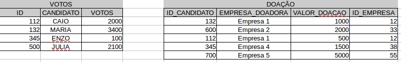

# Transformando Dados

Aviso importante!
-----------------

Antes de começar a programar, atualize o R e seus pacotes rodando os
seguintes comandos:

    install.packages("installr")

    updateR()

Siga as instruções e em caso de dúvidas procure um monitor. Lembre-se de
instalar o tidyverse novamente.

Atenção! Se liga aí que é hora da revisão (e dicas)!
====================================================

Scripts
-------

Scripts nada mais são do que uma série de comandos salvos em um arquivo.
Eles são úteis para mantermos a reprodutividade do código, portanto,
sempre que formos utilizar o RStudio é recomendado escrever um script.

Vetores
-------

-   Estrutura básica de dados
-   Homogêneo: aceita apenas um tipo de dado
-   Indexação por colchetes simples
-   Apenas 1 nível

Listas
------

-   Estrutura de dados
-   Heterogêneo: aceita mais de um tipo de dado
-   Indexação por colchetes duplo
-   Múltiplos níveis

Funções
-------

O R base, como chamamos o R sem nenhum pacote instalado por nós, já
contém diversas funções implementadas para realizar ações sobre os dados
que temos a disposição. Geralmente, o nome das funções já nos dão uma
noção de suas ações. Por exemplo, a função `mean()`, do português média,
aplica justamente a média sobre os dados informados. Para informar os
dados e também definir alguns dos comportamentos dessa ação, usamos o
parâmetros, que ficam dentro dos parênteses de cada função.

Exercícios de revisão
---------------------

Para praticarmos algumas coisas que vimos até agora tente fazer os seguintes exercícios:

1.  Baixe este
    [arquivo](https://drive.google.com/file/d/1tPmuLY3zNxMQBpDlmZz7f2SK7cPdC1rP/view?usp=sharing)
    e importe-o para seu projeto do RStudio.
2.  Calcula a média de colesterol e armazene-a em um objeto chamado
    med\_colesterol.
3.  Verifique se os valores de colesterol de cada observação são maiores
    do que a média.
4.  Separe a coluna age\_sex, criando as colunas age e sex com seus
    respectivos valores.

dplyr e suas funções
====================

Para tornar a manipulação de dados mais eficiente, foi criado um pacote
chamado de dplyr que possui uma série de ferramentas para filtrar,
selecionar e sumarizar informações, como veremos a seguir.

Funções
-------

As principais funções do dplyr são:

1.  `filter`: filtra as linhas de um banco de dados de acordo com uma
    regra lógica.

2.  `select`: seleciona as colunas de interesse.

3.  `mutate`: modifica ou cria colunas de acordo com valores fornecidos.

4.  `count`: conta os valores de uma variável.

-   Especialmente útil para variáveis categóricas.

1.  `rename`: altera o nome das variáveis (colunas).

2.  `group_by` e `summarise`: são funções normalmente utilizadas em
    conjunto. Elas permitem realizar operações de agregações com o banco
    de dados e, assim, alterar a nossa unidade de análise.

Porém, não ficaremos apenas nestas funções, veremos também algumas de
suas variações e conheceremos o famoso `%>%` (pipe).

Para as atividades abaixo vamos usar o mesmo banco utilizado nos
exercícios.

Como vimos, o dplyr é um pacote essencial para manipulação de dados e
uma das suas vantagens é que a forma como aplicamos suas funções segue o
seguinte padrão:

`funcao_dplyr(banco_de_dados, argumentos_especificos)`

Ou seja, o primeiro argumento de qualquer uma das funções é o banco de
dados, seguido de argumentos específicos de cada função, como por
exemplo, qual variável criar ou filtrar.

### `filter()`

Quando estamos fazendo algumas análises, é comum encontrarmos
observações que não nos interessam, como por exemplo, se estou fazendo
uma análise sobre pessoas com açúcar no sangue em jejum menor ou igual
do que 120mg/dl, espero que na minha base de dados tenham apenas pessoas
que atendam essa condição. Para isso utilizamos o `filter()`, vejamos o
exemplo abaixo:

    filter(dados, fbs == 0)

Lembra quando vimos operadores lógicos? Pois bem, eles são muito
utilizados no `filter()`. Caso o nosso interesse seja não apenas filtrar
sobre a taxa de açucar , mas pessoas do sexo masculino adicionamos o
nome da variável, seguido do condicional

    filter(dados, fbs == 0, sex == "Homem")

E se além dos filtros propostos também quisermos separar os candidatos
com Tipo de dor no peito igual a 1 e 4? Para fazer esse filtro podemos
utilizar o operador `%in%`! Ele basicamente nos ajuda a filtrar mais de
um tipo de categoria de uma variável, uma vez que o operador `==`
compara apenas uma categoria.

    filter(dados, fbs == 0, sex == "Homem", cp %in% c(1, 4)) # perceba a importancia de colocar as categorias que serao filtradas dentro de um vetor

Vamos aproveitar para filtrar os casos em que os pacientes não tiveram
angina induzida por exercício e guardar esse dado em um objeto chamado
`amostra1`.

    amostra1 <- filter(dados, fbs == 0, sex == "Homem", cp %in% c(1, 4), exang != 1)

Agora temos uma outra base de dados para analisarmos. Vamos conhecer
então o `select()`.

### `select()`

Em muitas situações nós não trabalhamos com todas as variáveis do banco
de dados; para removermos aquelas colunas que não iremos utilizar,
adotamos a função `select()`. Vamos selecionar apenas a idade e a
pressão sanguínea.

    select(amostra1, age, trestbps)

Percebeu o padrão dessa função? Basicamente é o banco de dados e as
variáveis que queremos selecionar. Mas e se quisermos visualizar todas
as variáveis com exceção de algumas?

    select(amostra1, -target, -restecg)

No exemplo acima estamos retirando as variáveis target e restecg
colocando um `-` na frente dessas variáveis.

Para darmos continuidade às outras funções vamos retirar algumas
variáveis

    amostra1 <- select(amostra1, -slope, -ca, -thal)

### `mutate()`

Caso tenhamos interesse em alterar ou criar uma variável, podemos
utilizar o `mutate()`. A função tem o seguinte formato:
`mutate(bando_de_dados, coluna_nova|coluna_existente = valor)`.

Vamos aproveitar e alterar a variável de idade `age` para númerico

    amostra1 <- mutate(amostra1,
    age = as.numeric(age))

    amostra1

Simples não? Além disso, podemos criar variáveis categóricas, como por
exemplo, uma variável que identifica se a pessoa tem uma idade maior ou
menor de 60 anos.

    amostra1 <- mutate(amostra1, CATEGORIA_IDADE = ifelse(age >= 60, "IDOSO", "ADULTO"))

    amostra1

Perceba que para criar essa variável utilizamos uma função chamada
`ifelse()`. Basicamente esta função é um if em que o primeiro parâmetro
é a condição lógica, o segundo é a ação em caso de a condição ser
verdadeira e o terceiro é a ação no caso de a condição ser falsa. Assim,
no caso acima ele pergunta: Se o valor da variável age for menor à 60,
classificamos como “ADULTO”, caso negativo, “IDOSO”.

Agora que criamos a variável “CATEGORIA\_IDADE”, quantas pessoas são
idosas neste experimento? Para respondermos isso podemos utilizar a
função `count()`

### `count()`

Em uma tradução literal, o `count()` irá contar as categorias de uma
variável.

    tabela_cat_idade <- count(amostra1, CATEGORIA_IDADE)

    tabela_cat_idade

Portanto, podemos notar que existem mais adultos em nossa amostra.

### `rename()`

Se quisermos renomear o nome das variáveis temos que utilizar o
`rename()` que tem o seguinte padrão:

`rename(bando_de_dados, nome_novo = nome_antigo)`

    tabela_cat_idade <- rename(tabela_cat_idade, Quantidade = n)

    tabela_cat_idade

### `group_by()` e `summarise()`

O `group_by()` e `summarise()` são funções que trabalham, na maioria das
vezes, juntas. Eles servem para sumarizar os dados de acordo com grupos,
ou seja, a contagem que haviamos feito com o `count()` pode ser
reproduzida aqui da seguinte forma:

    temp_1 <- group_by(amostra1, CATEGORIA_IDADE)

    temp_1

    summarise(temp_1, Quantidade = n())

O objeto `temp_1` é uma tabela agrupada! Visualmente ela parece normal,
porém qualquer operação feita nela será realizada de acordo com os
grupos nos quais ela encontrou, que neste caso é: ADULTO e IDOSO.

Quando utilizamos o summarise, iremos agrupar as categorias em torno de
uma estatística, no caso, a contagem. Para fazer isso, utilizamos a
função `n()`, uma função utilizada para contar obervações. Caso a
variável que fossemos sumarizar fosse númerica, poderiamos utilizar a
média (`mean()`), mediana (`median()`) e assim por diante.

Portanto, a vantagem do `group_by()` e `summarise()` é que conseguimos
sumarizar com outras estatísticas além da contagem. Vejamos o exemplo
abaixo. Estamos agrupando pela categoria de idade e sexo do indivíduo.
Após isto, estamos contando o número de observações que apresentam estas
categorias.

    temp_2 <- group_by(dados, CATEGORIA_IDADE, sex)

    summarise(temp_2, Quantidade = n())

Com isso podemos verificar que houveram maior participação de adultos na amostra.

### `%>%`

Até então, vimos as principais funções do `dplyr`. Conseguimos extrair
uma amostra com características específicas e esboçar algumas conclusões
sua variabilidade.

Também poderíamos fazer igual ao código abaixo, porém a interpretação
desse código se torna mais complexa, uma vez que as ações são realizadas
de dentro pra fora.

    rename(count(mutate(select(filter(dados, fbs == 0, sex == "Homem", cp %in% c(1, 4), exang != 1), -slope, -ca, -thal), age = as.numeric(age), CATEGORIA_IDADE = ifelse(age >= 60, "IDOSO", "ADULTO")), CATEGORIA_IDADE), Quantidade = n)

Para solucionar este problema os desenvolvedores do pacote incluiram um
operador chamado de pipe (`%>%`). Basicamente ele permite que possamos
contruir códigos de forma linear, como podemos notar abaixo!

    dados %>%

    filter(fbs == 0, sex == "Homem", cp %in% c(1, 4), exang != 1) %>%

    select(-slope, -ca, -thal) %>%

    mutate(age = as.numeric(age),

    CATEGORIA_IDADE = ifelse(age >= 60, "IDOSO", "ADULTO")) %>%

    count(CATEGORIA_IDADE) %>%

    rename(Quantidade = n)

Agora podemos interpretar o código acima da seguinte maneira:

> Pegamos a nossa base de dados sobre doenças cardíacas com o nome
> “dados”, aplicamos um FILTER para filtrar as observações do banco, em
> seguida o SELECT para removermos colunas que não queremos. Depois
> alteramos e criamos variáveis com MUTATE; contamos o número de
> observações de uma variável com o COUNT e por fim, mudamos o nome de
> uma variável com RENAME.

Você pode estar pensando: Mas que benefício eu tenho com o pipe? Ele
otimiza o nosso tempo escrevendo o código, já que não precisamos
escrever os objetos para sobrescrever às saídas e também diminui a
complexidade do código ao mesmo que aumenta sua legibilidade.

Em resumo, o pipe, quando utilizado com `dplyr` tem a seguinte
estrutura:

1.  Banco de dados

2.  Operações de manipulação

Joins
-----

Muitas vezes precisamos combinar informações de tabelas diferentes para
conseguir responder as nossas perguntas. Vejamos as tabelas abaixo:

    

Estas duas tabelas são referentes à nível de colesterol de alguns
pacientes e aos registros de atividades físicas feitas pelos pacientes
por semana; elas são duas tabelas diferentes ligadas apenas pela
variável “ID”. Sendo assim, para conectá-las precisaremos fazer com que
exista um match entre ID. Aqui entram os diferentes tipos de ‘joins’.

Os `*_join()` nada mais são que funções que ajudam a combinar duas
tabelas através de uma “variável de ligação”, que normalmente costuma
ser uma variável de identificação única da observação, como por exemplo,
o CPF de um indivíduo.

    tbl_colesterol <- data.frame(ID = c("112", "132", "345", "500"),

    NOME = c("CAIO", "MARIA", "ENZO", "JULIA"),

    COLESTEROL = c(233, 226, 142, 105),

    stringsAsFactors = FALSE) # PARA EVITAR QUE OS DADOS SEJAM TRANSFORMADOS EM CATEGORICOS

    tbl_atfisica <- data.frame(ID_PACIENTE = c("132", "600", "500", "345", "700"),

    TIPO = c("Futebol", "Caminhada", "Corrida", "Corrida", "Natação"),

    DURACAO_HORAS = c(0.5, 3, 2, 1, 2),

    ID_atfisica = c("12", "33", "12", "38", "55"),

    stringsAsFactors = FALSE)

### `inner_join()`

O primeiro join que veremos é o `inner_join()`, que retorna a
intersecção das tabelas `tbl_colesterol` e `tbl_atfisica`, ou seja, a
saída é uma nova tabela com informações em comum entre os dados. No caso
exemplificado, o resultado são três observações em comum entre as
tabelas dado o mesmo ID.

Perceba que para montar a função de join, precisamos de três argumentos:

-   x: que aqui chamaremos de tabela à esquerda

-   y: que aqui chamaremos de tabela à direita

-   by: argumento que especifica qual é a variável de ligação entre as
    tabelas. Caso a variável tenha o mesmo nome das duas tabelas, você
    pode colocar apenas o nome da variável, como por exemplo,
    `by = "ID"`. Porém, caso os nomes sejam diferentes o padrão para
    especificar é
    `by = c("variavel_tbl_esquerda" = "variavel_tbl_direita")`.

<!-- -->

    inner_join(tbl_colesterol, tbl_atfisica, by = c("ID" = "ID_PACIENTE"))

### `left_join()` e `right_join()`

Nesse caso pensamos se queremos que a nossa tabela pós join tenha o
número de linhas da tabela da esqueda (`left_join`) ou da tabela da
direita (`right_join`), utilizando o mesmo padrão do exemplo anterior.

    # Left join

    left_join(tbl_colesterol, tbl_atfisica, by = c("ID" = "ID_PACIENTE"))

Perceba que todas as observações da tabela da esquerda estão no
resultado final, porém o ID de número 500 tem observações missing. Isso
se dá devido ao fato de que na tabela da direita não existe referência
ao seu ID.

Caso o intuito seja manter todas as linhas da tabela da direita
utilizamos o `right_join`.

    # Right join

    right_join(tbl_colesterol, tbl_atfisica, by = c("ID" = "ID_PACIENTE"))

### `full_join()`

Mas se quisermos juntar todas as observações das duas tabelas podemos
utilizar o `full_join`

    full_join(tbl_colesterol, tbl_atfisica, by = c("ID" = "ID_PACIENTE"))

### `anti_join()`

E se quisermos somente as observações que não dão match entre as
tabelas? Usamos `anti_join()`. Porém, neste caso, temos que mudar a
ordem das tabelas para observar quais casos não deram match.

    anti_join(tbl_colesterol, tbl_atfisica, by = c("ID" = "ID_PACIENTE"))

    anti_join(tbl_atfisica, tbl_colesterol, by = c("ID_PACIENTE" = "ID")) # lembre-se de alterar a ordem do by

Wrap-up
=======

Vamos juntar tudo o que aprendemos e tirar alguma informação dos dados?
Exiba a média de colesterol SOMENTE das pessoas em que o valor da
pressão sanguínea foi maior que a média das observações por sexo e
categoria de idade. Tente usar o pipe `%>%`

Respostas - Exercícios de revisão
---------------------------------

Exercício 1

    dados <- read_csv('heart_mod2.txt')

Exercício 2

    media_colesterol <- mean(dados$chol)

Exercício 3

    media_colesterol > dados$chol

Exercício 4

    dados <- separate(dados, age_sex, c('age', 'sex'), sep = '/')
